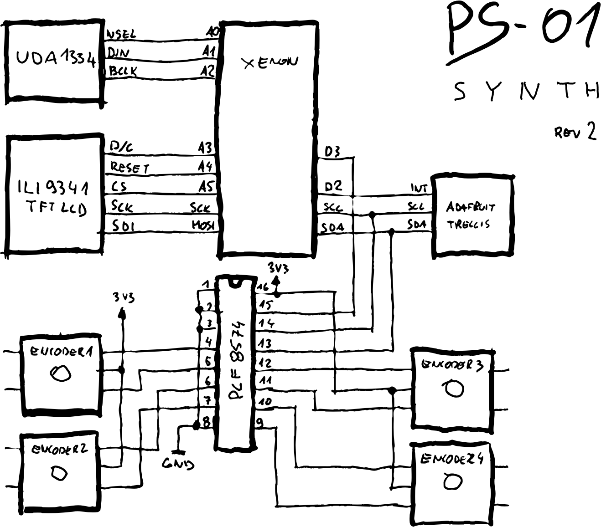
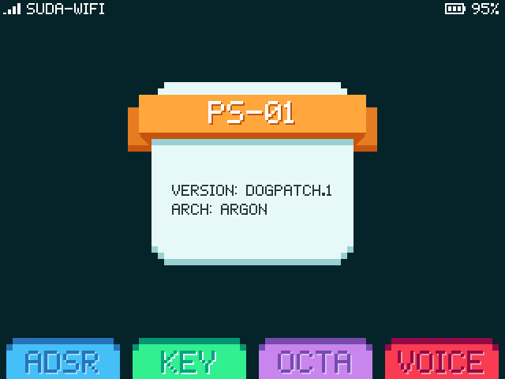

# PS-01 synthesizer

[](https://travis-ci.org/suda/ps-01)

Software synthesizer running on Particle 3rd gen devices (Argon, Boron or Xenon), inspired by MOS6581 and Pocket Operator.

## Abstract

[See planned milestones and features](docs/ps-01.pdf).

### Hardware

This is a tentative list of components used in this build:

* [Particle 3rd gen device (Argon/Boron/Xenon)](https://store.particle.io/collections/bluetooth)
* [Adafruit I2S Stereo Decoder](https://www.adafruit.com/product/3678)
* 320x240 TFT LCD compatible with [Adafruit GFX Graphics Library](https://learn.adafruit.com/adafruit-gfx-graphics-library/overview)
* four rotary encoders with switches driven by [PCF8574](https://www.ti.com/lit/ds/symlink/pcf8574.pdf)
* [Adafruit Trellis](https://www.adafruit.com/product/1616) keypad
* [MAX3421E based USB host controller](https://www.aliexpress.com/item/32735946108.html)

#### Circuit diagram


### Software

This synth is designed to run both on embedded device but also to be compiled on a desktop (helps with debugging).

#### Compiling for desktop

```
$ cmake .
$ make
$ ./build/ps_01
```
#### UI


[UI documentation and guidelines](docs/ui.md)

## Code structure

### `/src/synth`

Main sound synthesis code including voices, ADSR and effects.

Proposed features of the engine are:

* six independent audio oscillators with:
	* four different waveforms per audio oscillator (sawtooth, triangle, pulse, noise)
	* variable pulse width
	* multi mode filter (low-pass, high-pass and band-pass)
	* ADSR volume controls
	* ability to specify channel (left, right or both)
* six ring modulators

This is similar to having two [SID chips](https://en.wikipedia.org/wiki/MOS_Technology_SID#Features).

### `/src/midi`

MIDI abstraction including:
* MIDI over USB-OTG interface
* MIDI over DIN5 connector
* QWERTY keyboard support

### `/src/sequencer`

Code for controlling sound engine and generate actual music out of sounds. Does things like chords, arpeggio, note to frequency conversion.

### `/src/ui`

User interface (physical buttons, leds and screen) code.

### `/lib`

Vendored 3rd party libraries.

## References

* https://ccrma.stanford.edu/software/stk/
* [VICE - C64 emulator with multiple SID implementations (reSID, FastSID)](http://vice-emu.sourceforge.net/index.html#download)
* [NES Audio - series of videos explaining some chiptune effects](https://www.youtube.com/playlist?list=PLW9dSXWX1cLKxzAsxP4dfWyhK3B1bAzJg)
* [wavepot - tool for live sound synthesis](http://wavepot.com/)
* [SID chip datasheet](http://www.waitingforfriday.com/index.php/Commodore_SID_6581_Datasheet)