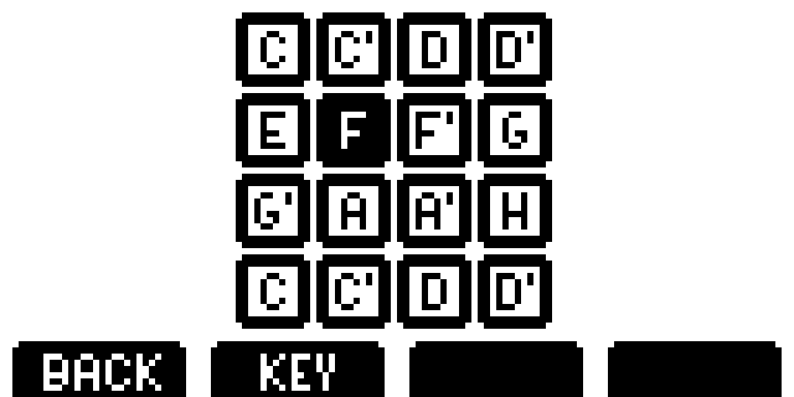
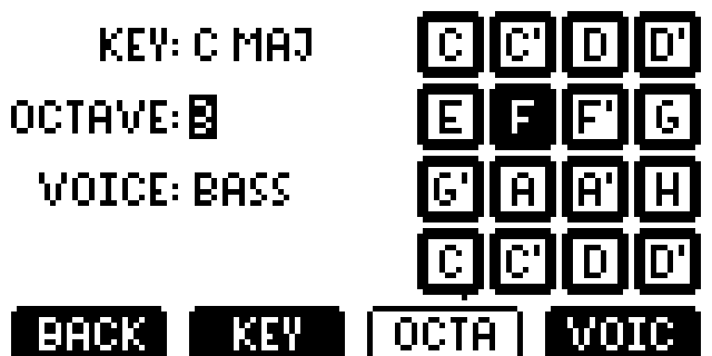

# User Interface

Originally a 128x64 monochrome LCD screen was used, which had some UI designed for it:

Due to problems with controlling the UC1701 chip and how the screen looked in comparison to the size of the whole synth it was replaced with a 320x240 TFT screen.

This prompted a updated UI design.

## Thick Pixel UI

Based on a [Low Poly Game](https://creativemarket.com/iamwowu/1786300-GUI-for-Low-Poly-Game) GUI kit by wowu (due to licence, it can't be distributed with ps-01 sources).

### Principles

#### Status bar

Contains information about the device, similar to one in a smartphone. Possible information:

* WiFi/network quality
* Battery status
* SD card status
* BPM/volume/octave

#### Knob bar

Bottom bar with four tabs that correspond with the four knobs below the screen. They are colored blue, green purple and red (similarly to the [op-1](https://teenage.engineering/products/op-1)).